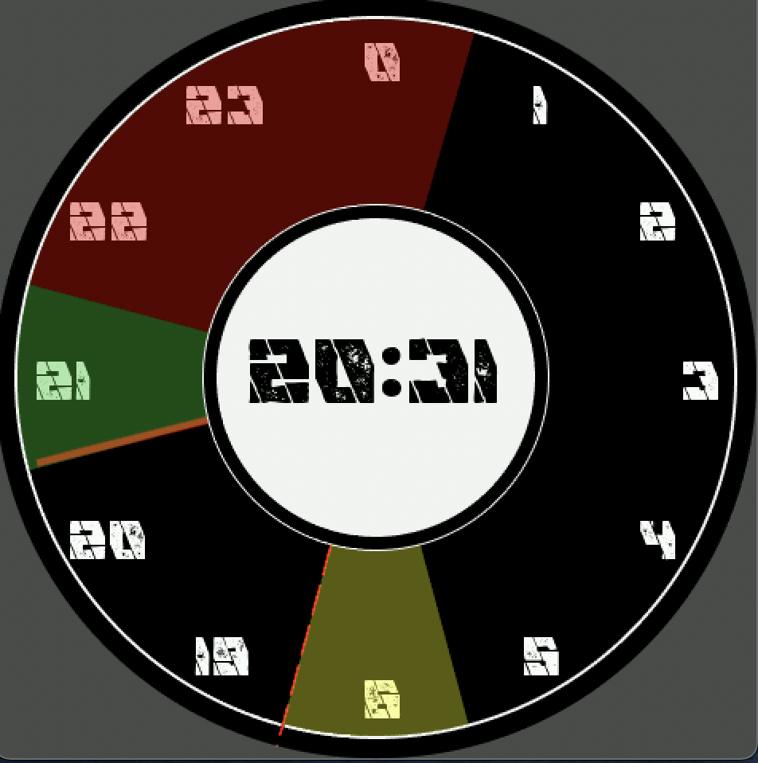
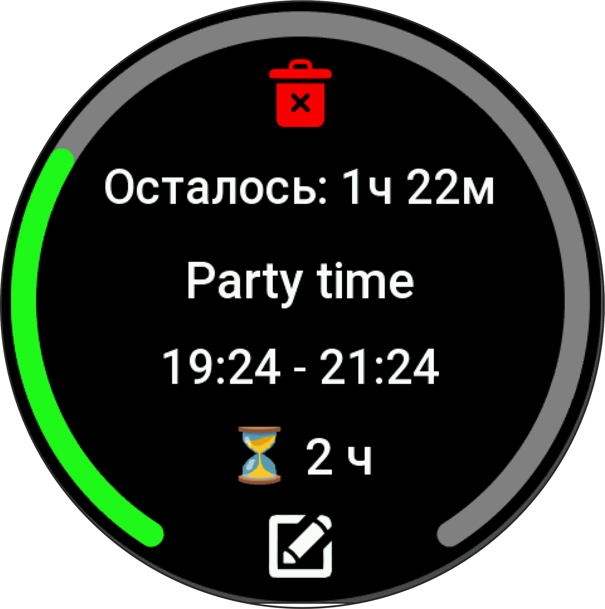
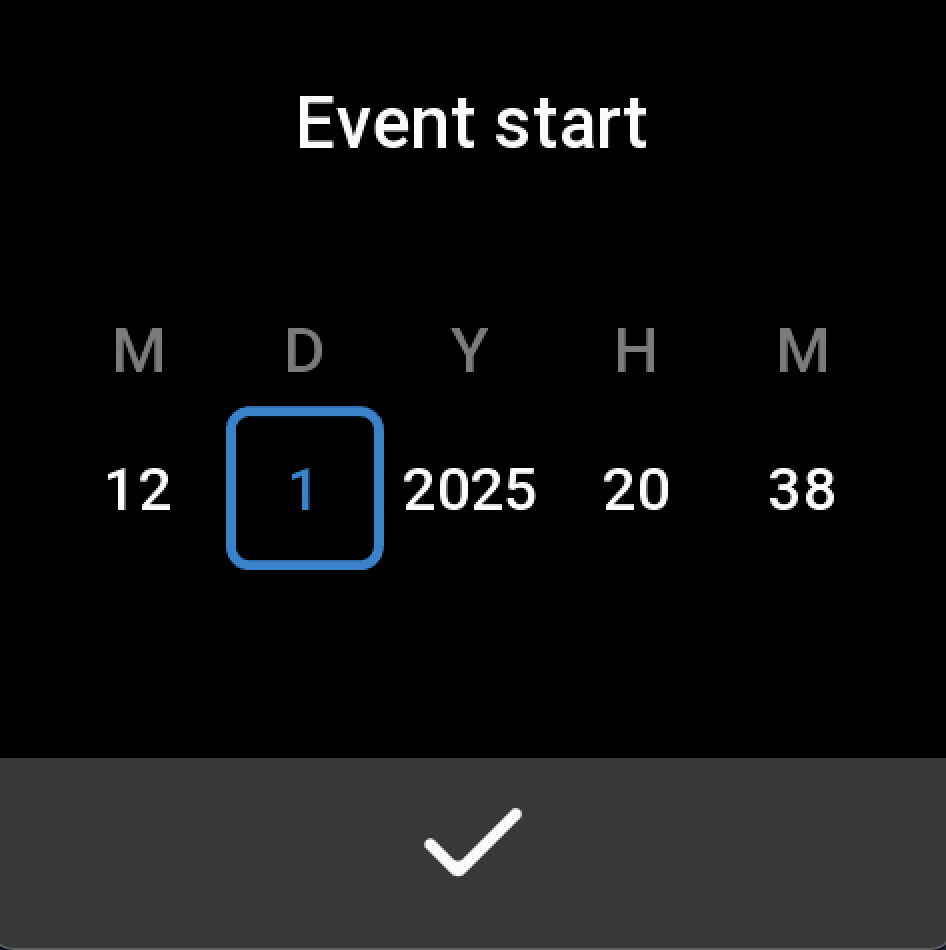
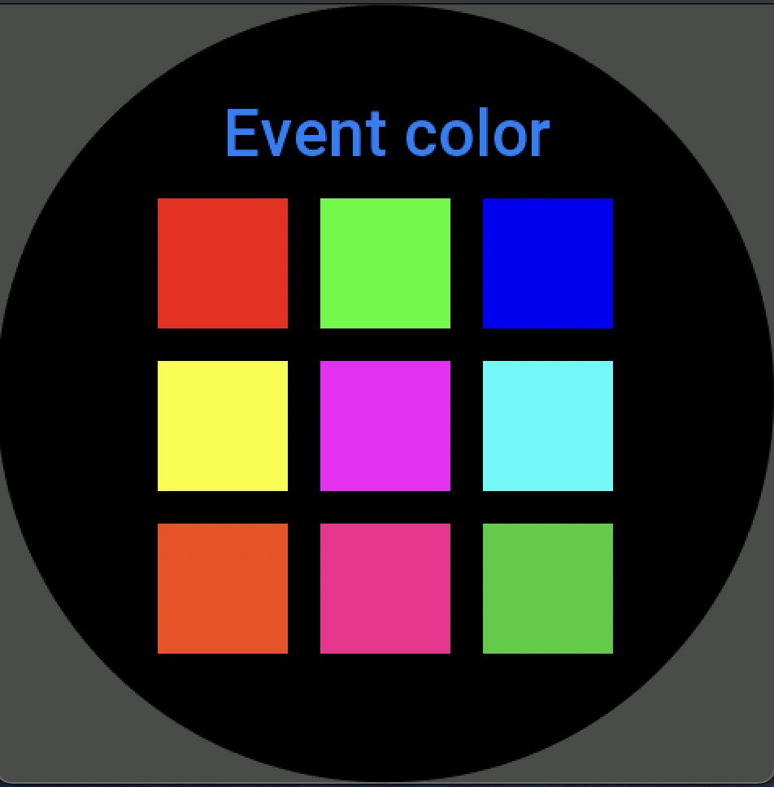

# Event Manager for Amazfit Smartwatches

## English Version

### Event Manager - Your Daily Schedule on Your Wrist

**Event Manager** is a comprehensive scheduling application designed specifically for Amazfit smartwatches that transforms your watch face into an interactive daily planner.

### 📋 Core Features

#### 1. **Event Creation & Management**
- **Create Events**: Add appointments, meetings, reminders with custom descriptions
- **Time Settings**: Set precise start/end times with date selection
- **Status Tracking**: Mark events as active, pending, or completed
- **Quick Actions**: Swipe-to-delete functionality

#### 2. **Visual Timeline Display**
- **Arc Visualization**: Events appear as colored arcs around the watch face
- **Real-time Updates**: Watch events progress throughout the day
- **Color Coding**: Different colors for various event types
- **Interactive Elements**: Tap on arcs to view event details

#### 3. **Intuitive Interface**
- **Gesture Controls**: 
  - Swipe left: Open menu
- **Dual Time Display**: Both analog and digital time
- **Multi-language**: English and Russian support
- **Responsive Design**: Optimized for small screen interactions

#### 4. **Smart Organization**
- **Automatic Cleanup**: Past events are automatically managed
- **Data Persistence**: Events saved between sessions
- **Scrollable Lists**: Easy navigation through all events
- **Contextual Actions**: Right actions at the right time

#### 5. **Watch Face Integration**
- **Customizable Display**: Shows only relevant information
- **Minimal Battery Impact**: Efficient coding for long battery life
- **Always Available**: Access schedule without pulling out your phone

### 🎯 Perfect For
- Business professionals managing meetings
- Students tracking class schedules
- Fitness enthusiasts planning workouts
- Anyone needing daily reminder management

---

## Русская версия

### Event Manager - Ваше расписание на запястье

**Event Manager** — это комплексное приложение для планирования, разработанное специально для умных часов Amazfit, которое превращает циферблат ваших часов в интерактивный ежедневник.

### 📋 Основные функции

#### 1. **Создание и управление событиями**
- **Создание событий**: Добавляйте встречи, собрания, напоминания с описаниями
- **Настройка времени**: Устанавливайте точное время начала/окончания с выбором даты
- **Отслеживание статуса**: Отмечайте события как активные, ожидающие или завершенные
- **Быстрые действия**: Функция удаления свайпом

#### 2. **Визуальная шкала времени**
- **Дуговое отображение**: События отображаются в виде цветных дуг вокруг циферблата
- **Обновления в реальном времени**: Наблюдайте за прогрессом событий в течение дня
- **Цветовая кодировка**: Разные цвета для различных типов событий
- **Интерактивные элементы**: Нажмите на дугу для просмотра деталей события

#### 3. **Интуитивный интерфейс**
- **Управление жестами**:
  - Свайп влево: для вызова меню
- **Двойное отображение времени**: Аналоговое и цифровое время
- **Многоязычность**: Поддержка русского и английского языков
- **Адаптивный дизайн**: Оптимизирован для работы на маленьком экране

#### 4. **Умная организация**
- **Автоматическая очистка**: Прошедшие события автоматически обрабатываются
- **Сохранение данных**: События сохраняются между сеансами
- **Прокручиваемые списки**: Легкая навигация по всем событиям

### 🎯 Подходит для
- Бизнес-профессионалов, управляющих встречами
- Студентов, отслеживающих расписание занятий
- Любителей фитнеса, планирующих тренировки
- Всех, кому нужно управление ежедневными напоминаниями

---

## 🚀 Технические особенности

### **Платформа**
- Разработано для Zepp OS 2.0+
- Совместимость с Amazfit GTS/GTR серий
- Оптимизировано для круглых экранов

### **Производительность**
- Минимальное потребление памяти
- Быстрая загрузка и отклик
- Фоновая обработка событий

### **Безопасность**
- Все данные хранятся локально на часах
- Нет доступа в интернет
- Конфиденциальность гарантирована

---

## 📞 Поддержка

Приложение находится в активной разработке. Ценю ваши отзывы и предложения!

**Поддержать проект:** 

**Контакты:** 
- Email: belkamydog22@gmail.com

---

## 📄 Лицензия

© 2024 Event Manager. Все права защищены.
Это приложение предоставляется бесплатно для личного использования.

---

*Последнее обновление: Ноябрь 2024*