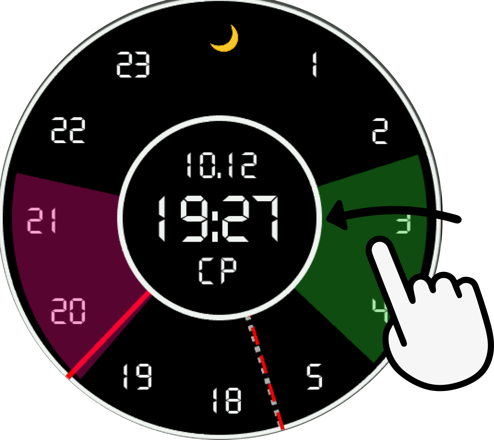
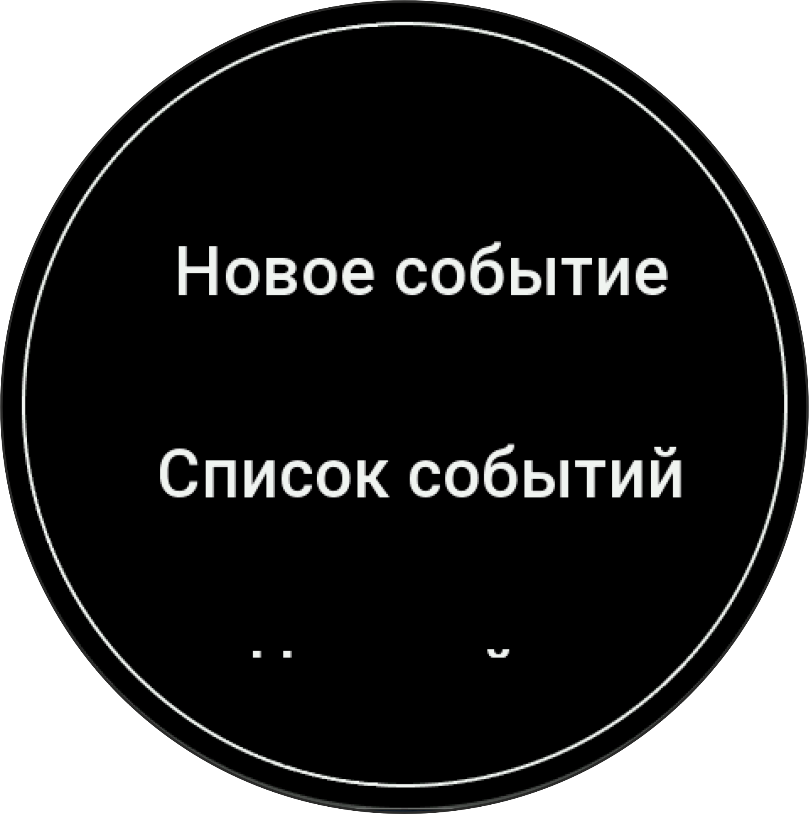
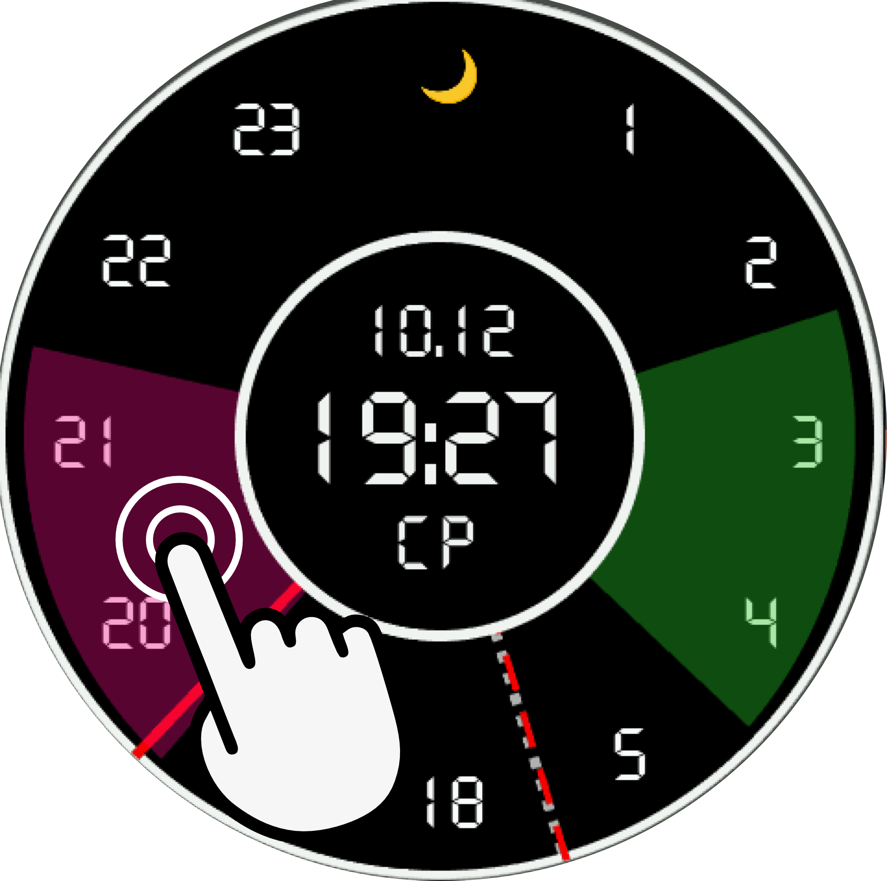

### ClockWise — Your Schedule at a Glance

**ClockWise** is a comprehensive scheduling application designed specifically for Amazfit smartwatches, transforming your watch face into an interactive daily planner.

### 📋 Key Features

#### 1. **Event Creation and Management**
- **Event Creation**: Add meetings, appointments, and descriptions
- **Visualization**: View events and daily workload directly on the watch face
- **Time Settings**: Set precise start and end times with date selection
- **Status Tracking**: List of events: active, pending, or completed
- **Flexible Settings**: Swipe-to-delete function, easy navigation, auto-delete and repeat event settings, and color selection

#### 2. **Visual Time Scale**
- **Arc Display**: Events shown as colored sectors
- **Real-time Updates**: Monitor event progress throughout the day
- **Color Coding**: Different colors for various event types
- **Interactive Elements**: Tap on a sector to view event details

#### 3. **Intuitive Interface**
- **Gesture Controls**:
- Swipe left to open the main menu
- **Dual Time Display**: Analog and digital time
- **Multilingual Support**: Russian and English language support
- **Adaptive Design**: Optimized for small screens

#### 4. **Smart Organization**
- **Automatic Cleaning**: Past events are automatically processed, with customizable frequency
- **Data Persistence**: Events saved between sessions
- **Scrollable Lists**: Easy navigation through all events

### 🎯 Ideal For
- Executives managing meetings
- Students tracking class schedules
- Fitness enthusiasts planning workouts
- Anyone needing daily reminder management

## Controls and Navigation
- **Swipe left to open the main menu**

- **Event list with navigation and detailed description**

- **Tapping a sector opens the event page**

- **Edit or delete events**

---

## 🚀 Technical Features

### **Platform**
- Developed for Zepp OS 4.0+
- Compatible with Amazfit T-Rex-3, Balance2
- Optimized for round screens

### **Performance**
- Minimal memory usage
- Fast loading and response times

### **Security**
- All data stored locally on the watch
- No internet access required
- Privacy guaranteed

---

## 📞 Support

The application is under active development. Your feedback and suggestions are highly appreciated!

**Contacts:**
- Email: belkamydog22@gmail.com

## Support the Project:

## Download to Your Device

---

## 📄 License

© 2024 Event Manager. All rights reserved.
This application is provided free of charge for personal use.

---

*Last updated: December 2024*

### ClockWise - Ваше расписание на запястье

**ClockWise** — это комплексное приложение для планирования, разработанное специально для умных часов Amazfit, которое превращает циферблат ваших часов в интерактивный ежедневник.

### 📋 Основные функции

#### 1. **Создание и управление событиями**
- **Создание событий**: Добавляйте встречи, собрания, с описаниями
- **Визуализация**: Увидеть события и посмотреть загруженность дня прямо на циферблате
- **Настройка времени**: Устанавливайте точное время начала/окончания с выбором даты
- **Отслеживание статуса**: Список событий: активные, ожидающие или завершенные
- **Гибкая настройка**: Функция удаления свайпом, легкая навигаця,настройки авто-удаления и повтора событий а так же выбор цвета

#### 2. **Визуальная шкала времени**
- **Дуговое отображение**: События отображаются в виде цветных секторов
- **Обновления в реальном времени**: Наблюдайте за прогрессом событий в течение дня
- **Цветовая кодировка**: Разные цвета для различных типов событий
- **Интерактивные элементы**: Нажмите на сектор для просмотра деталей события

#### 3. **Интуитивный интерфейс**
- **Управление жестами**:
- Свайп влево: для вызова меню
- **Двойное отображение времени**: Аналоговое и цифровое время
- **Многоязычность**: Поддержка русского и английского языков
- **Адаптивный дизайн**: Оптимизирован для работы на маленьком экране

#### 4. **Умная организация**
- **Автоматическая очистка**: Прошедшие события автоматически обрабатываются, можно легко настроить необходимую для Вас частоту
- **Сохранение данных**: События сохраняются между сеансами
- **Прокручиваемые списки**: Легкая навигация по всем событиям

### 🎯 Подходит для
- Руководителей, для управления встречами
- Студентов, отслеживающих расписание занятий
- Любителей фитнеса, планирующих тренировки
- Всех, кому нужно управление ежедневными напоминаниями

## Управление и навигация
- **Свайп влево для вызова главного меню**

- **Список событий с навигацией и подробным описанием**

- **Тап по сектору вызовет страницу события**

- **Можно отредактировать или удалить событие**

---

## 🚀 Технические особенности

### **Платформа**
- Разработано для Zepp OS 2.0+
- Совместимость с Amazfit T-Rex-3. balance2
- Оптимизировано для круглых экранов

### **Производительность**
- Минимальное потребление памяти
- Быстрая загрузка и отклик

### **Безопасность**
- Все данные хранятся локально на часах
- Нет доступа в интернет
- Конфиденциальность гарантирована

---

## 📞 Поддержка

Приложение находится в активной разработке. Ценю ваши отзывы и предложения!

**Контакты:** 
- Email: belkamydog22@gmail.com

## Поддержать проект:

## Скачать на устройство

---

## 📄 Лицензия

© 2024 ClockWise. Все права защищены.
Это приложение предоставляется бесплатно для личного использования.

---

*Последнее обновление: Декабрь 2024*